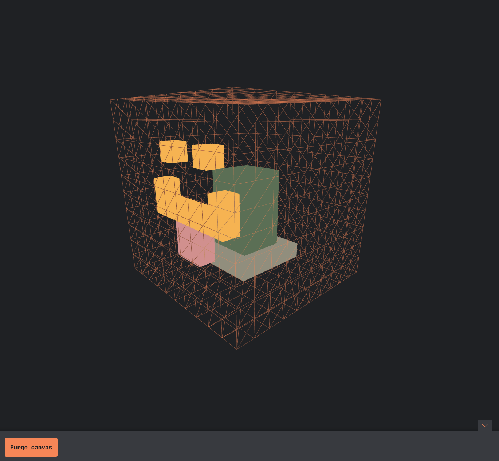

# Spaces

A collaborative voxel experience

# Requirements

1. Go installed
2. Node

# Optional dependencies

1. (optional) [Air](https://github.com/cosmtrek/air) for go. It's a live reloading tool.
2. Protobuf compiler if you want to make changes to protobuffer files

# Tools

Generator scripts for compiling the protobuffer files to go and typescript can be found in the _tools_ directory.

# Setup
1. `go install` in root directory
2. `npm install` in root directory if you plan on compiling the protobuffer files.
3. `npm install` in the `client` directory.

# Development
1. Start go server by running `air` for live reloading or `go run .`
2. Start the webpack development server by navigating to the `client` directory and running `npm run dev`
3. Visit `localhost:8080`
